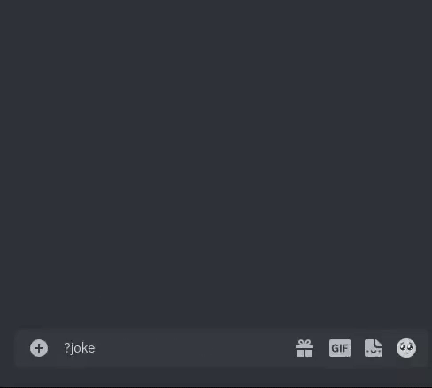

<div align="center">
    <h1>
        Joke-bot
    </h1>
    <p align="center">
    Simple Discord bot to tell random jokes.
        <br/>
        <strong>·</strong>
        <a href="https://github.com/AntonVanAssche/joke-bot/issues">Report Bug</a>
        <strong>·</strong>
        <a href="https://github.com/AntonVanAssche/joke-bot/issues">Request Feature</a>
    </p>
    <p align="center">
        <a href="https://github.com/AntonVanAssche/joke-bot/graphs/contributors">
            
        </a>
        <a href="https://github.com/AntonVanAssche/joke-bot/network/members">
            
        </a>
        <a href="https://github.com/AntonVanAssche/AntonVanAssche/joke-bot">
            
        </a>
        <a href="https://github.com/AntonVanAssche/AntonVanAssche/joke-bot">
            
        </a>
        <a href="https://github.com/AntonVanAssche/joke-bot/blob/master/LICENSE.md">
            
        </a>
</div>



## How it works

Currently the bot uses four different APIs to get the jokes, memes and pickup lines.
One of which is the [JokeAPI](https://jokeapi.dev/) used to get the random jokes.
This API is a highly customizable API, open source and free to use for everyone.
It allows you to fetch random jokes from a variety of categories, such as `programming`, `misc`, `dark`, `pun`, `spooky` and `christmas`, making it the perfect API for this bot.

The second API used is a Reddit API that returns Reddit posts in JSON format.
This is a basic API that I made myself, you can find it on [GitHub](https://github.com/AntonVanAssche/RedditAPI). This API is intended to be hosted locally, so there is no remote URL to use.

The third API used is the [pickup-lines-api](https://rapidapi.com/sfehqlfsau/api/pickup-lines-api/). This is a free API that can be used to get random pickup lines.
The only downside is that it requires an API key, which you can get for free by signing up on [RapidAPI](https://rapidapi.com/).

The last API used is the [Evil Insult Generator](https://evilinsult.com/api/). This API is used by the `!insult` command to get a random insult.

## Commands

Underneath you will find a list of commands that the bot can use.

-   `!help`: Shows this help message.
-   `!ping`: Pong!
-   `!stats`: Shows the bot's stats.
-   `!joke`: Get a random joke.
-   `!category <category>`: Get a random joke from a specific category.
    -   categories: `programming`, `misc`, `dark`, `pun`, `spooky`, `christmas`
-   `!pickup-line`: Get a random pickup line.
-   `!insult`: Get a random insult.
    -   You can also mention a user to insult them.
    -   Example: `!insult @bob`
-   `!meme`: Get a random meme from Reddit.

Do you have a recommendation for a new command? Feel free to [submit it here](https://github.com/AntonVanAssche/joke-bot/issues/new).

## Installation

There are two ways to use the bot, either by running t directly on your machine or by running it within a Docker container.

### Running the bot directly

Firstly we will need to clone the repository. You can do this by running the following command in your terminal:

```console
$ git clone https://github.com/AntonVanAssche/joke-bot.git
$ cd joke-bot
```

Once you have successfully cloned the project, you'll have to update the `config.json` file with your bot token.
You can find the token in the [Bot Settings](https://discordapp.com/developers/applications/me) of your bot under the `Bot` tab.
If you wish to change the prefix of the bot, you can do so in the `config.json` file. This is by default `!`.

```json
{
    "prefix": "---YOUR-BOT-PREFIX---",
    "token": "---PLACE-YOUR-TOKEN-HERE---"
}
```

Since the `pickup-lines-api` requires an API key, you will have to create a `.env` file in the root directory of the project. This file will contain the API key.
You can get the API key by signing up on [RapidAPI](https://rapidapi.com/).

```console
$ echo "RAPID_API_TOKEN=<YOUR-API-TOKEN>" > ./src/.env
```

Once you have successfully configured the `config.json` file and the `.env` file, you can start the bot by running the following command in your terminal:

```console
$ cd src/                    # Go to the source directory.
$ npm install                # Install the dependencies.
$ node ./index.js            # Actually run the bot.
```

### Running the bot within a Docker container

Firstly we will need to clone the repository. You can do this by running the following command in your terminal:

```console
$ git clone https://www.github.com/AntonVanAssche/joke-bot.git
$ cd joke-bot
```

Just like when running the bot directly, you'll have to update the `config.json` file with your bot token.
You can find the token in the [Bot Settings](https://discordapp.com/developers/applications/me) of your bot under the `Bot` tab.
If you wish to change the prefix of the bot, you can do so in the `config.json` file. This is by default `!`.

```json
{
    "prefix": "---YOUR-BOT-PREFIX---",
    "token": "---PLACE-YOUR-TOKEN-HERE---"
}
```

Since the `pickup-lines-api` requires an API key, you will have to create a `.env` file in the root directory of the project. This file will contain the API key.
You can get the API key by signing up on [RapidAPI](https://rapidapi.com/).

```console
$ echo "RAPID_API_TOKEN=<YOUR-API-TOKEN>" > ./src/.env
```

Once you have successfully configured the `config.json` file and the `.env` file, you can start the bot by running the following command in your terminal:

```console
$ docker build -t joke-bot .
```

This process is rather quick, but it will take a few minutes depending on your internet connection.
When it comes to the actual running of the bot, you have two options. Either you run the bot in the foreground or in the background (deamon mode).

```console
$ docker run joke-bot        # Run the bot in the foreground.
$ docker run -d joke-bot     # Run the bot in the background.
```

That's it! You can now use the bot by sending a message to the bot with the `!joke` command.
If you encountered any issues while installing the bot, feel free to [report them here](https://github.com/AntonVanAssche/joke-bot/issues/new).

## Contributing

Contributions are what make the open source community such an amazing place to learn, inspire, and create. Any contributions you make are **greatly appreciated**.

If you have a suggestion that would make this better, please fork the repo and create a pull request. You can also simply open an issue with the tag `enhancement`.
Don't forget to give the project a star! Thanks again!

1. Fork the Project
2. Create your Feature Branch (`git checkout -b feature/AmazingFeature`)
3. Commit your Changes (`git commit -m 'Add some AmazingFeature'`)
4. Push to the Branch (`git push origin feature/AmazingFeature`)
5. Open a Pull Request

See [`CONTRIBUTING.md`](./CONTRIBUTING.md) for more information.

## Feedback

This project isn't perfect, therefore suggestions/improvements are always [welcome](https://github.com/AntonVanAssche/joke-bot/issues)!
